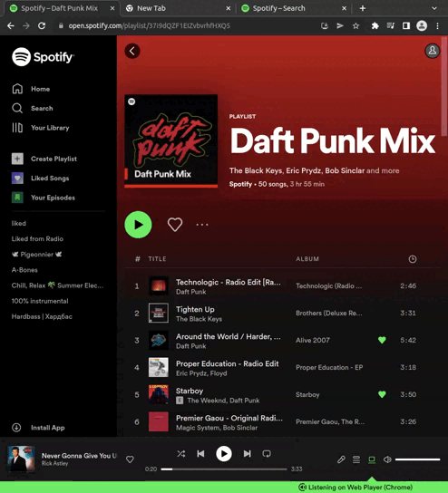

# Rearrange your Spotify music according to their proximity
using the t-SNE algorithm, the Spotify API and a GUI.

# [Test it online!](https://wd400.github.io/Spotify_t-sne_playlist/)

## Getting Started

1- Copy the id of the source playlist in the interface.  
2- Click on "Load playlist".  
3- Draw the music sequence for the new playlist.  
4- Click on "Save" to save the playlist on Spotify.  

## Run it locally
1- Clone this repository
2- Create a Spotify app https://developer.spotify.com/dashboard/applications
3- Copy the app client ID to App.js (default abbc32cff69c46928a3b4e0bb7f43fab)
4- In the repo execute "yarn run start"
5- Go to http://127.0.0.1:3000